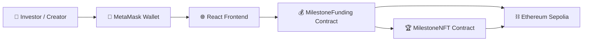

# 🚀 ProofFlow

### Decentralized Milestone-Based Funding Protocol


> Transparent crowdfunding powered by **milestone verification and DAO governance**

---

# 🌐 Live Demo

🔗 **Try ProofFlow**

[https://proofflow-teal.vercel.app/project](https://proofflow-teal.vercel.app/project)

⚠️ Requires **MetaMask Wallet + Sepolia Network**

---

# 📸 Demo Preview

```md

```

```md

```

```md

```

```md

```

---

# 📌 Table of Contents

1. Overview
2. Problem
3. Solution
4. Core Features
5. System Architecture
6. Smart Contracts
7. Tech Stack
8. Project Structure
9. Setup Instructions
10. How It Works
11. Smart Contract Addresses
12. Impact
13. Future Improvements

---

# 🌍 Overview

Traditional crowdfunding platforms suffer from:

* Lack of transparency
* No accountability for project creators
* Upfront funding risks

**ProofFlow introduces milestone-based escrow funding on blockchain.**

Funds are **locked in smart contracts** and released only when milestones are verified by contributors.

---

# ❗ Problem

| Problem                     | Impact                          |
| --------------------------- | ------------------------------- |
| Upfront funding             | Reduced accountability          |
| No milestone verification   | Investors cannot track progress |
| Centralized platforms       | Limited trust                   |
| No proof of work completion | Hard to validate delivery       |

---

# 💡 Solution

ProofFlow solves this using:

* 🔒 Smart contract escrow
* 🗳 DAO milestone voting
* 🪙 On-chain payment release
* 🏆 NFT achievement badges
* 🔎 Transparent blockchain records

---

# ✨ Core Features

### 🪙 Milestone-Based Funding

Projects define milestones with specific funding amounts.

---

### 🗳 DAO Governance Voting

Investors vote to approve milestone completion.

---

### 🔒 Escrow Smart Contracts

Funds stay locked until the milestone is approved.

---

### 🏆 NFT Achievement Rewards

Creators receive **milestone NFTs** when completing milestones.

---

### 🔎 Transparent Blockchain History

Every action is stored on-chain.

---

# 🧱 System Architecture



---

# 🧠 Smart Contract Modules

| Contract             | Responsibility                                     |
| -------------------- | -------------------------------------------------- |
| MilestoneFunding.sol | Project creation, escrow funding, milestone voting |
| MilestoneNFT.sol     | Mint milestone NFTs                                |

---

# 🛠 Tech Stack

### Frontend

* React
* TailwindCSS
* Ethers.js
* React Router

### Blockchain

* Solidity
* Hardhat
* Ethereum Sepolia

### Deployment

* Vercel
* IPFS (optional)

---

# 📁 Project Structure

```
proofflow
│
├── contracts
│   ├── MilestoneFunding.sol
│   └── MilestoneNFT.sol
│
├── scripts
│   └── deploy.js
│
├── frontend
│   ├── src
│   │   ├── components
│   │   ├── pages
│   │   ├── services
│   │   ├── hooks
│   │   └── utils
│
├── hardhat.config.js
├── package.json
└── README.md
```

---

# ⚙️ Setup Instructions

Clone the repository

```bash
git clone https://github.com/modimrugesh1910/proofflow.git
cd proofflow
```

Install dependencies

```bash
npm install
```

Compile contracts

```bash
npx hardhat compile
```

Deploy to Sepolia

```bash
npx hardhat run scripts/deploy.js --network sepolia
```

Start frontend

```bash
cd frontend
npm install
npm start
```

---

# 🔄 How It Works

```
Creator creates project
        ↓
Investors fund project
        ↓
Funds locked in smart contract
        ↓
Creator submits milestone
        ↓
Investors vote
        ↓
Milestone approved
        ↓
Payment released
        ↓
Milestone NFT minted
```

---

# 🔗 Smart Contract Addresses

| Contract         | Network | Address |
| ---------------- | ------- | ------- |
| MilestoneFunding | Sepolia | `0x...` |
| MilestoneNFT     | Sepolia | `0x...` |

---

# 📊 Impact

| Sector          | Impact                         |
| --------------- | ------------------------------ |
| Startup Funding | Transparent milestone payments |
| DAO Grants      | Community driven approval      |
| Open Source     | Verified contributions         |
| Web3 Builders   | Increased trust                |

---

# 🚀 Future Improvements

* Decentralized identity verification
* IPFS milestone proof storage
* Multi-chain support
* Reputation system for creators
* DAO governance token

---

# 📜 License

MIT License

---

# ⭐ Support

If you like this project, please consider **starring the repository** ⭐

---